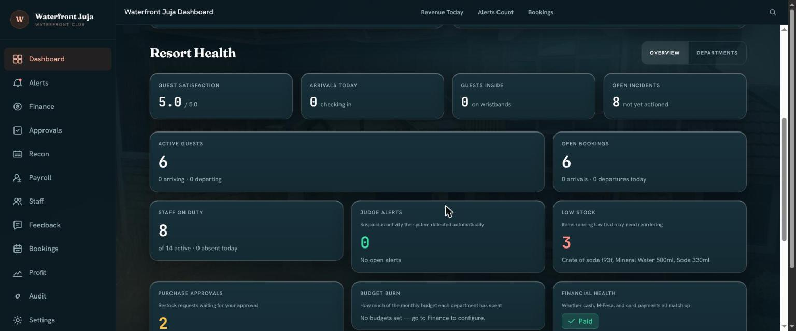
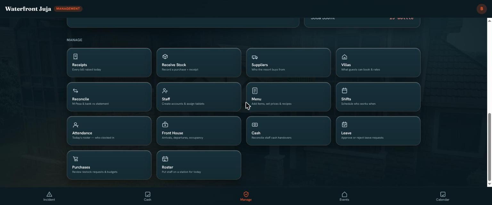
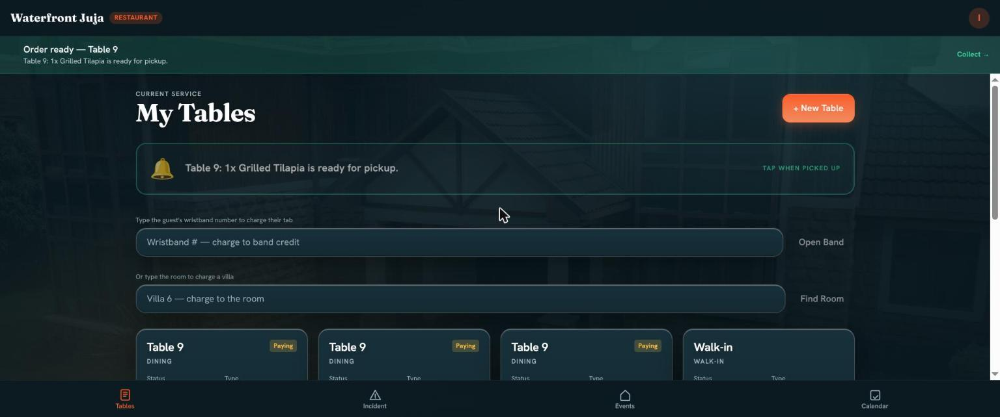

# Waterfront — Resort Operations

A complete operating system for a boutique resort: point of sale, stock, staff,
bookings, gate wristbands and the owner's books, in one codebase. Every sale,
shift and shilling is recorded once, by the person who was standing there, and
the owner can read the whole property from a phone.

Built and run for a lakeside resort in Juja, Kenya.

**1,441 automated tests · a full simulated working day green at 38/38 · 70
dashboards and tills opened as the person who uses each one**



---

## What problem it solves

Resorts leak money in places nobody is watching: stock that walks, tabs that
are never closed, cash that arrives at the safe short, a wristband used twice,
a shift somebody clocked for a friend. Most of it is invisible in a system
built from spreadsheets and goodwill.

This one is built so the leaks have nowhere to hide:

- **Live figures are derived, never stored.** Stock is the sum of every
  movement; a bill is charges minus payments. There is no editable "current
  balance" field anywhere.
- **History is frozen at the moment it happens.** The price on an old order
  line is the price charged that day. Changing a menu price tomorrow cannot
  rewrite last week's takings.
- **Nothing is deleted.** Every record is disabled instead, so the history
  already written stays written.
- **The audit log is hash-chained.** Each row carries a fingerprint of the row
  before it, so removing or editing one breaks every row after it — and
  `flask audit_cli verify-chain` says so.

---

## Who uses what

Three separate applications, because a waiter and an owner do not need the same
software — and should not be able to reach the same data.

| App | Port | For | Holds |
|---|---|---|---|
| `station_pwa` | 5176 | Tills and posts | Gate, restaurant and bar tills, kitchen and bar boards, spa, water, front desk, villas, and the manager's screens |
| `owner_pwa` | 5175 | The owner | Dashboard, money, approvals, reconciliation, payroll, staff, audit trail, settings |
| `employee_pwa` | 5173 | Each employee | Clock in, roster, leave, payslip, conduct, disputes, suggestions |

`shared_ui` carries the design tokens and the components all three use.

| | |
|---|---|
|  |  |
| The manager's hub — tiles carry live counts, and only the ones with a person waiting take the accent | A waiter's tables, with the order-ready bar that follows them across every screen |

---

## What it does

**Selling** — Tills at the gate, restaurant, bar, spa, water sports and front
desk. Cash, M‑Pesa and card at every one, with an M‑Pesa prompt pushed to the
guest's own phone where the business credentials are configured. A day guest's
wristband carries credit they spend anywhere on the property.

**Kitchen** — Orders reach the kitchen and bar boards with an audible alert and
a live timer. When a plate is marked ready the waiter who sent it is told, out
loud, wherever they are in the app.

**Stock** — Every menu item declares how it draws down stock: from a recipe,
straight from a stock item, or as a service that consumes nothing. An item that
declares nothing cannot be sold, which is what stops silent leakage. Physical
counts are compared against the ledger, and spoilage, staff meals and
sent-back items are their own movements so they explain a gap rather than hide
inside one.

**People** — Clock-in is refused off the resort's own network, which is what
stops one person clocking in another from home. Staff do not clock out; the
roster closes the shift. Payroll drafts from the clock records.

**Guests** — Villa bookings with deposits, check-in and check-out, a folio a
guest can charge from anywhere on the property, waivers for water activities,
and guest feedback that feeds a staff member's performance score.

**Watching** — A "judge" runs daily and weekly looking for what a person would
have to be staring at to notice: portion sizes drifting on one cook's shift,
void rates above the team average, a gate headcount that exceeds the bands
issued, a safe count that does not match.

---

## Stack

Python 3.12 · Flask 3 · SQLAlchemy 2 · Alembic · Argon2 · SQLite in development,
Postgres in production · React 18 + Vite + TypeScript · TanStack Query ·
Zustand · Tailwind · Framer Motion · pytest · Playwright

---

## Getting started

```bash
# ── Backend ─────────────────────────────────────────────────
python3.12 -m venv .venv && source .venv/bin/activate
pip install -r requirements.txt
cp .env.example .env                 # placeholders — fill in your own values

flask db upgrade                     # create the schema
flask seed roles-depts               # roles and departments
flask seed owner                     # the first owner account
flask run --port 5000
```

```bash
# ── Any of the three front ends ─────────────────────────────
cd station_pwa      # or owner_pwa, or employee_pwa
npm install
npm run dev
```

One thing will stop you on a fresh install, by design: **clock-in refuses
everybody until the resort's own network is registered**, because being on the
property's network is what makes attendance mean anything. The owner adds it
under Settings; for local development, `flask hr seed-wifi` allows localhost.

---

## Layout

```
app/
  auth/          sign-in, PINs, account lifecycle
  pos/           menu, orders, kitchen and bar queues, tabs, payments
  inventory/     items, counts, movements, purchases
  finance/       cash, reconciliation, budgets, payment sockets
  hr/            profiles, clock-in, shifts, leave, performance
  bookings/      resources, bookings, deposits, waivers
  gate/          wristbands, entry credit, end-of-day forfeit
  events/        events, assignments, alerts
  judge/         the detection engine
  dashboard/     owner aggregations
  services/      business logic per domain
  models/        45+ SQLAlchemy models
tests/           1,441 tests, plus Playwright sweeps
scripts/         verification drivers — see below
migrations/      Alembic
```

---

## Testing

```bash
pytest                                   # the whole suite
pytest tests/test_pos.py -v              # one file
pytest -x                                # stop at the first failure
```

Five kinds of checking, because each catches what the others miss:

| | What it answers |
|---|---|
| `pytest` | Do the rules hold? Money is never a float, a payment cannot land twice, a disabled account stops on the next request |
| `scripts/roleplay_day.py` | Does a whole working day work end to end, as fourteen real accounts at their real permission levels? |
| `scripts/every_screen.py` | Does every dashboard and till answer for **the person who uses it** — and does money actually move through each point of sale? |
| `scripts/pwa_contract.py` | Does every button lead somewhere real, and is anyone offered a control the system will then refuse? |
| `scripts/preflight.py` | The mechanical checks that would have caught the last set of bugs — including whether the dev server is running the code on disk |

The most common fault in a system like this is not a crash. It is a button
offered to somebody the system then refuses, which teaches staff the software
is unreliable and that the way round it is to stop using it.
`pwa_contract.py` probes every read the front end makes as a real user at each
permission level and reports any it would be refused.

---

## Configuration is data

Roles, departments, menu items, prices, villa rates, alert thresholds, budgets
and the staff network are all owner-editable from the running system. Changing
how the resort works does not mean changing the code.

Payment integrations follow the same idea: M‑Pesa (Daraja) and the card gateway
are built and dormant, and activate when their credentials are present in the
environment. `GET /finance/mpesa/status` reports plainly what is missing. Until
then the till says so in plain words and falls back to recording the code from
the guest's confirmation SMS — it never offers a prompt it cannot send.

---

## Notes

Operational runbooks — deployment topology, disaster recovery, the owner's
anti-theft playbook — are deliberately kept out of this repository. They hold
no credentials, but they describe what the system does *not* catch, and that is
not something to publish.

Licensed for the property it was built for. The author retains the underlying
software.
